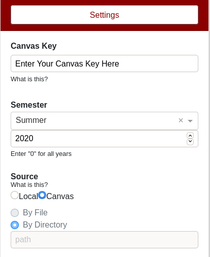
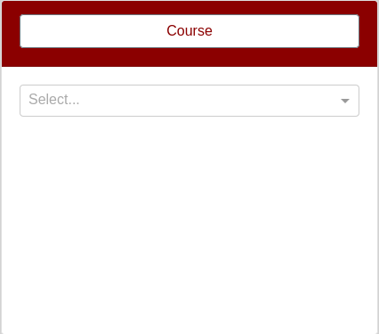
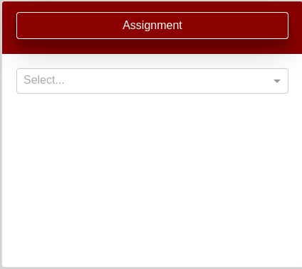
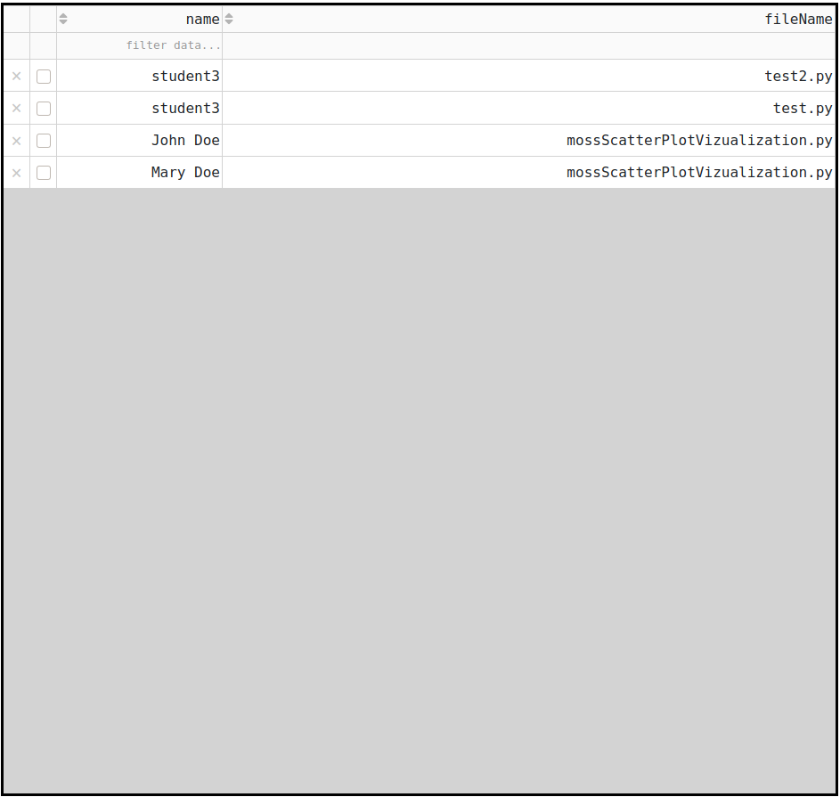
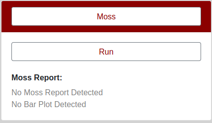
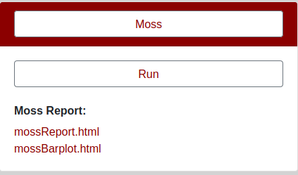

# Moss Canvas GUI

This Dash application was created to streamline the process of downloading assignments from canvas and running them through Moss.

## Important

For obvious license reasons I have removed Moss from this repository.  Any user wishing to use this app with Moss must have a license and must supply their own version of it.  Uses who have this should place is in the folder entitled "moss".  The folder "moss" must contain a file "moss.pl" for the app to work.

## Getting Started

1. Download all the dependencies (listed at the bottom) or run in the included virtual environment (On linux/Mac: source venv/bin/activate) (Note: you will still need to download perl)
2. Run python app.py (first download all the dependencies or run in a virtual environment)
2. Log into canvas and get your Canvas Key.  If you don't know how to do this, instructions are located in "What is this?" under "Canvas Key" in "Settings" in the app.  See the picture below

3. Enter your Canvas Key in the text box under "Canvas Key".  Now shutdown the app and restart it.  Your key has now been written to a text file "canvas/key.txt"

### Running the App on Canvas
* Select a course

* Select an assignment

* Select the language (i.e. if the assignment is in Python, select Python)

* Enter the file extensions of the files you wish to download.  
    * For instance, suppose students all submitted python files. Then type ".py".
    * For instance, suppose students all submitted zip files that contain python files.  Then type ".zip,.py" 

* Wait for the assignments to loaded in the middle window

* Once the assignments have loaded, you can select which assignments you would like to download and/or run through Moss.
    * For instance, suppose you only want to download and compare John and Mary, then select John and Mary using their respective checkboxes.
    * For instance, suppose you want to compare everything except student3's test2.py file.  Simply delete it by clicking the x.  (NoteL this doesn't delete it from Canvas, it just tells the application not to download and run it through Moss)

* If you have any base files, enter their path now.  See "What is this?" for more information

* When you are ready click the "Download Requested Assignments" button
    * Note, this could take a few minutes to hours depending on the number of requested submission, how large they are, and your internet speed.
    * Note, if you are downloading zip files, they will automatically be unzipped, and any requested files with the requested file extensions will be extracted.
        * For instance, suppose in the "File Extensions" you entered ".zip,.py".  Then all files with a ".py" extension will be extracted from the downloaded zip file for each student.  However all other files will be deleted.
    * Note, submissions will be downloaded into the folder "moss/courses/<course_name>/<assignment_name>/submissions" into separate directories for each student.
    
* Once the assignments have been downloaded, click "run" to run Moss on them.

* Once Moss has run, the reports will appear like below:

* To view the results, right click on them and open them in new tabs.
    * Note, once you open them in new tabs you will likely have to click enter in the address bar to get them to appear.
    * Results are saved in: "moss/courses/<course_name>/<assignment_name>/moss"
    
### Running the app on local files

To run this app on local files, under "Source" in "Settings" click "Local".  Then enter the complete path to the directory containing the submissions in the text box. As for what "By File" and "By Directory" see below.

#### By File vs. By Directory
The app can run on a directory containing assignment submissions of two types:
* Directory
    * Student1
        * Student1 files
    * Student2
        * student2 files
    * and so on...

OR

* Directory
    * file1
    * file2
    * file3
    * and so on....
    
If you want the first option, click "By Directory".  In this case, Moss will compare student assignments by directory.  I.e. all files of the specified file extension in a students directory will be considered as one with respect to Moss.  Moss will compare each students directory against all other students directory.

If you want the second option, click "By File".  In this case Moss will compare all files contained in the directory against one another.

Now once this is completed, select the language, and enter the appropriate base files and extensions.

Then when you are ready, run Moss and the results will appear.

## Bugs and/or Issues
* The submissions table in the middle of the app may not always load.  It appears to be a bug with Dash Datatables, if this happends refresh your browser or restart your app.
* Not all submissions were downloaded, or the app was unable to unzip files properly resulting in an error
    * Unfortunately Canvas has minimal abilities to restrict what students actually submit, so this app really is only as good as what restrictions the instructor places on submissions (like what file types students can submit) and what students submit themselves.
    * This app performs better when students submit their assignments as individual files and not as one zip file.  This is because:
        * The zip file becomes a black box so to speak, as the app cannot see what is in the zip file before downloading it.  Where as if students submit individual files, the app can see exactly what students have submitted.  This is reflected in the submissions table in the app.  Instructors can then specify what exactly they would like to download and run through Moss.
* The app did not finish downloading the assignment submissions
    * This is rare however it did occur in testing when trying to download assignments submissions where the total was approximately 15gb.  In this case the user will need to directly download them from Canvas and not use this app.
* Not all of my students submissions are showing up in the submissions table
    * Check the specified file extensions.  The app will only display files with the specified file extensions.  It is left to the user to ensure students submit files with the correct file extensions. This was done to ensure as much as possible that only the necessary files are downloaded.     

## Dependencies
The following dependencies are required:
- dash
- canvasapi
- dash-bootstrap-components
- pandas
- beautifulsoup4
- Perl - for Moss (its written in perl)

## What more can be done on this app
- Further work can be done on unzipping files.  Unzipping files is still error prone because students often submit incorrect files or bad file names etc.
- Additional error handling to minimize the need for refreshing the page
    - This one is a bit tricky, as Dash is not really built for this type of application.

## Questions

Email Aidan Vickars at avickars@sfu.ca
